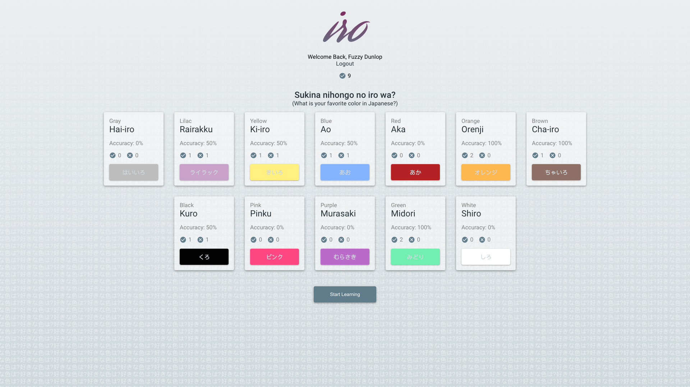

# Iro

Iro uses spaced repetition learning to teach you the words for a variety of colors in the Japanese language.

## Credits

Matt Patterson and Josh Struve.

## UI

Branding

Log In

Sign Up

Dashboard

Question

Correct Answer

Incorrect Answer

## Technology Stack

### Front End
React , HTML, CSS, JSON Web Tokens

### Back End
Express, Node, Postgresql, JWT

## Links

### Live App
url

### API Git
https://github.com/thinkful-ei-panda/Iro-api