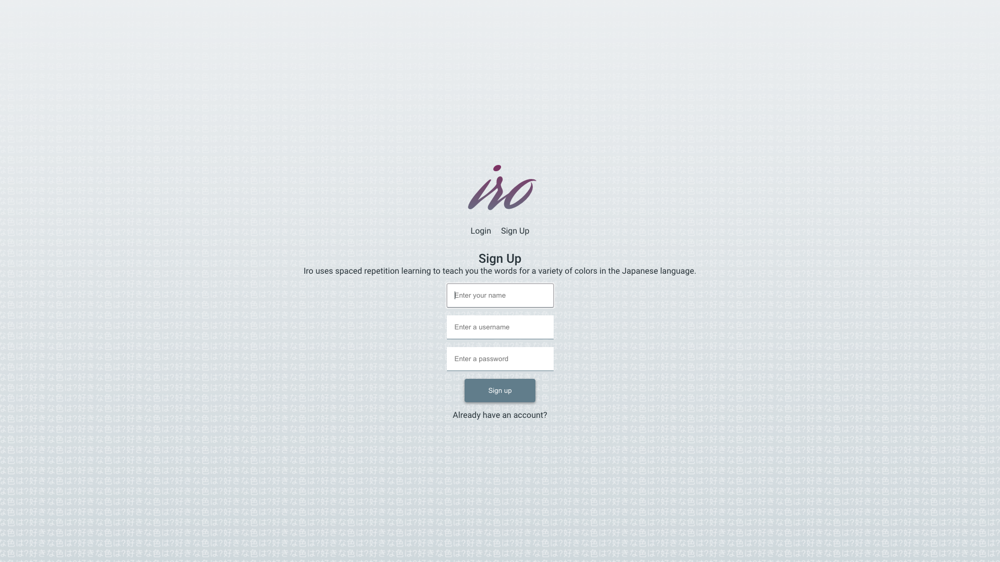
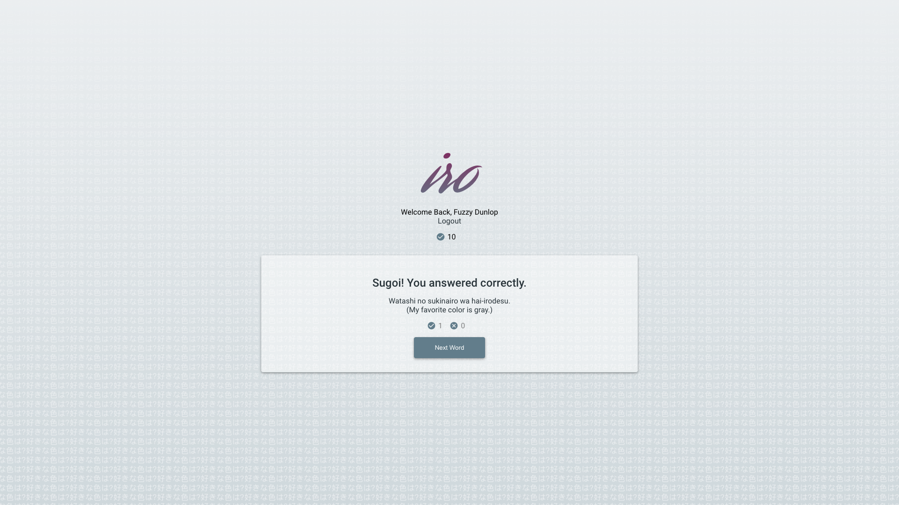
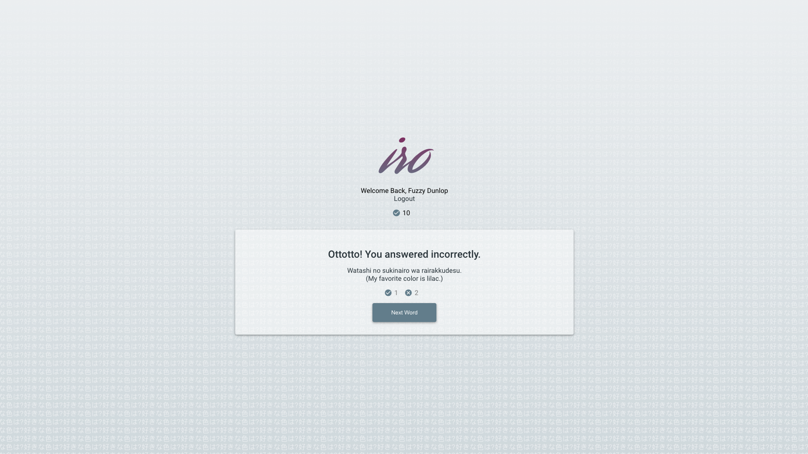

# Iro

Iro uses spaced repetition learning to teach you the words for a variety of colors in the Japanese language.

## Credits

---

Matt Patterson and Josh Struve.

## UI

---

### Branding


### Log In


### Sign Up



### Dashboard


### Question


### Correct Answer



### Incorrect Answer



## Technology Stack

### Front End

React, HTML, CSS, JSON Web Tokens


### Back End

Express, Node, Postgresql, JWT
- Dependencies: 
  - Password encryption - `bycrpytjs`
  - CORS cross-origin resource sharing - `cors`
  - HTML header security- `helmet`
  - JSON Web Token generation - `jsonwebtoken`
  - Database queries - `knex`
  - Backend Error/Status Logging - `morgan`
  - PostgreSQl database management - `pg`
  - Cross-site scripting attack protection - `xss`
- Test Dependencies: 
  - `chai`, `mocha`, `nodemon`, `supertest`

### UX/UI

Adobe XD

## Links

### Live App

url

### API Git

[IO - Server Repository](https://github.com/thinkful-ei-panda/Iro-api)

---

## Server

PERN stack
 - `PostgreSQL`
 - `Express.js`
 - `React.js`
 - `Node.js`
 
### Endpoints

Supported endpoints: 
 - `/auth/token`
 - `/language`
 - `/language/head`
 - `/language/guess`
 - `/user`
 
#### Sample Requests/Responses

`/auth/token`
  - Method: `/POST`
  - Request Params:
     - passwords must include at least 1 upper and lower case letter, 1 special character and 1 number
    ```javascript
    {
       "username": "Marco Amigo",
       "password": "Marco_password1"
    }
    ```
   - Response
      - `200`
      ```javascript
      {
        "authToken": "jwt generated bearer token"
      }
      ```
      - `400`
      ```javascript
      {
        "error": 'Incorrect username or password',
      }
      ```
`/language`
   - Method: `/GET`
   - Request Params: database user and language id
   - Response
      - `200`
      ```javascript
      {
        "language": {
         "id": 2,
         "name": "Japanese",
         "user_id": 2,
         "head": 13,
         "total_score": 0
        },
        "words": [
         {
          "id": 13,
          "language_id": 2,
          "original": "Orange",
          "translation": "Orenji",
          "next": 14,
          "memory_value": 1,
          "correct_count": 0,
          "incorrect_count": 0,
          "hex": "#FFB74D",
          "script": "orange.svg"
        },
         // ...
      }
      ```
      - `404`
        - no languages retrieved from the database
        ```javascript
        {
          "error": "You don't have any languages"
        }
        ```
`/language/head`
   - Method: `/GET`
   - Request Params: database language id
   - Response
     - `200`
     ```javascript
     {
       "nextWord": "Orange",
       "total_score": 0,
       "wordCorrectCount": 0,
       "wordIncorrectCount": 0,
       "hex": "#FFB74D",
       "script": "orange.svg"
     }
     ```
     - `400`
       - no words in the database
       ```javascript
       {
         "error": "Missing head"
       }
       ```
`/language/guess`
  - Method: `/POST`
  - Request Params:
    ```javascript
    {
      "guess": "orenji"
    }
    ```
  - Response:
    - `200`
    ```javascript
    {
      "nextWord": "Yellow",
      "wordCorrectCount": 1,
      "wordIncorrectCount": 0,
      "hex": "#FFB74D",
      "script": "orange.svg",
      "total_score": 1,
      "answer": "Orenji",
      "original": "Orange",
      "isCorrect": true
    }
    ```
    - `400`
      - request body is invalid or given empty response
      ```javascript
      {
        "error": "Missing 'guess' in request body"
      }
      ```
`/user`
   - Method: `/POST`
   - Request Params: 
     ```javascript
     {
       "name": "Marco Plebe",
       "username": "plebeus"
       "password": "PlbMrc_1_@"
     }
     ```
   - Response:
     - `200`
     ```javascript
     {
      "id": 3,
      "name": "Marco Plebe",
      "username": "plebeus"
     }
     ```
     - `404`
     ```javascript
     {
      "error": "Password must contain one upper case, lower case, number and special character"
     }
     ```
